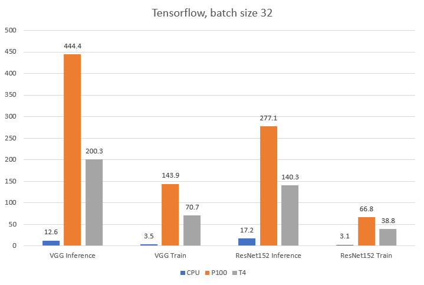
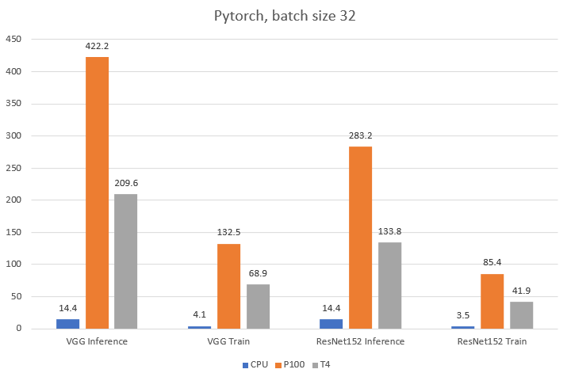
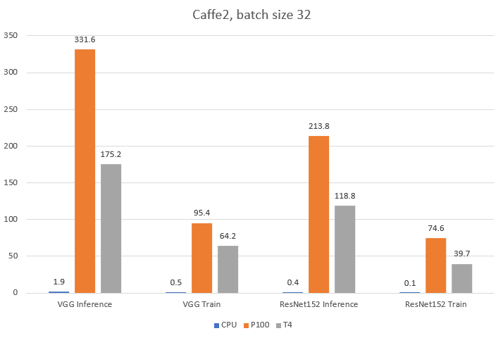
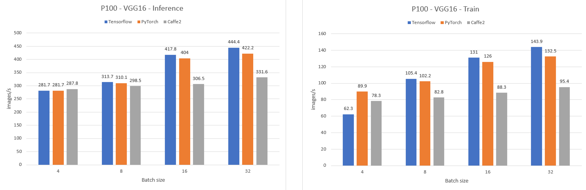
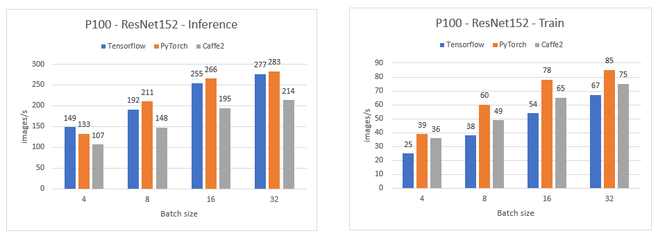
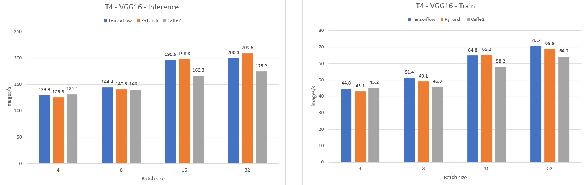
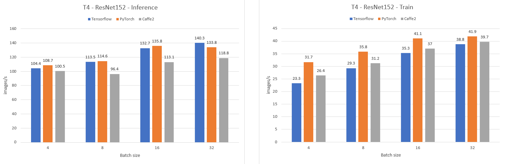
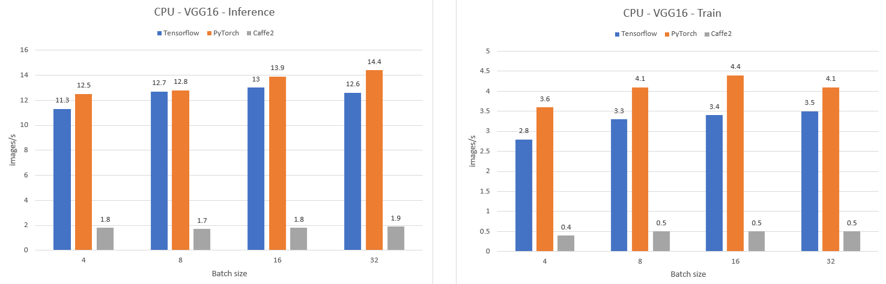
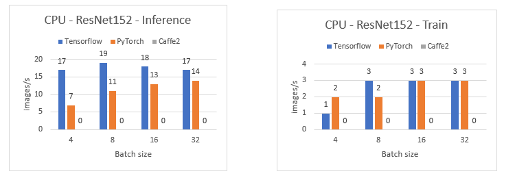

# DeepLearning Benchmark for multi-harware & multi-framework
## Framework:
- Tensorflow 1.13.1
- Pytorch 1.0.1.post2
- Caffe2 0.8.1
## Hardware:
- Nvidia Tesla P100
- Nvidia Tesla T4
- 2x Intel Xeon Silver 4114

    

    

    

    

    

    

    

    

    

